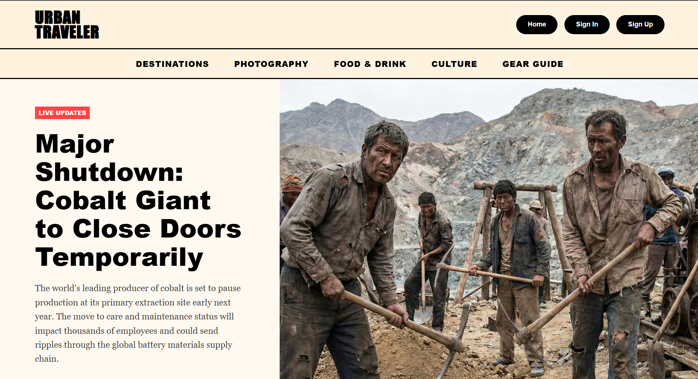
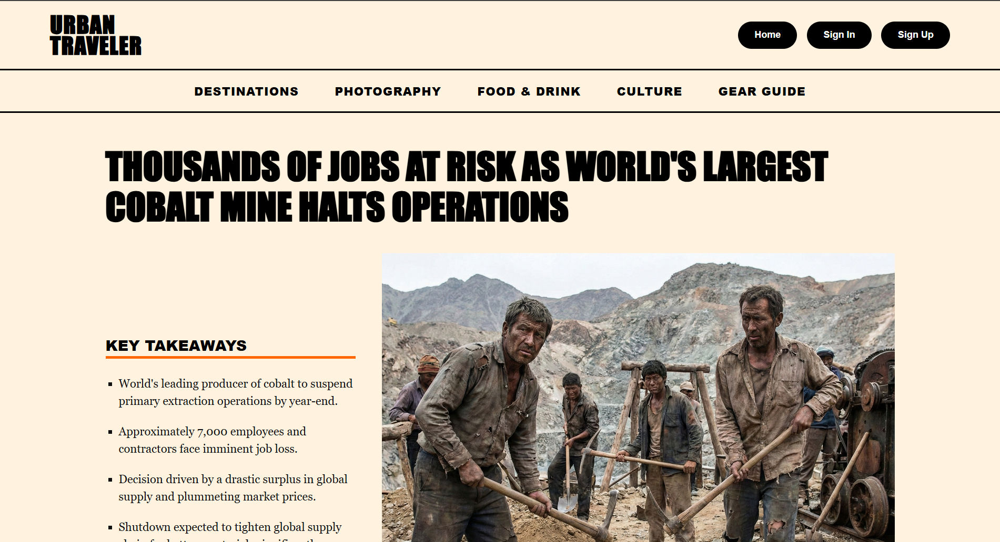

# 🌍 Urban Traveler Magazine

## 📖 Overview
**Urban Traveler** is a responsive digital magazine website designed to showcase travel stories, photography, and cultural insights. This project demonstrates modern web design principles, focusing on typography, visual hierarchy, and grid-based layouts to create an engaging reading experience for users.

## ✨ Key Features
* **Dynamic Home Page:** Features a "Live Updates" hero section and a sophisticated 3-column "Editor's Pick" grid layout.
* **Immersive Article Layout:** A dedicated article page (`article.html`) utilizing a split-screen design to balance high-quality imagery with readable text.
* **Responsive Design:** The layout adapts seamlessly to desktops, tablets, and mobile devices using CSS Media Queries.
* **Modern Styling:** Utilizes Flexbox and CSS Grid for structural alignment and CSS filters for visual effects.

## 🛠️ Tech Stack
* **HTML5:** Semantic markup for accessibility and SEO structure.
* **CSS3:** Advanced styling using external stylesheets (`magazine-style.css`, `article-style.css`).

## 🚀 How to Run
1.  Clone this repository:
    ```bash
    git clone [https://github.com/sharantejreddy1602-syntropy/urban-traveler-magazine.git](https://github.com/sharantejreddy1602-syntropy/urban-traveler-magazine.git)
    ```
2.  Navigate to the project folder.
3.  Open `index.html` in your web browser to view the **Home Page**.
4.  Click on any "Read More" button (or open `article.html`) to view the **Article Page**.

## 📸 Screenshots
### Home Page


### Article Page


## 👤 Author
**Madem Sharan Tej Reddy**
* **University:** Vellore Institute of Technology
* **GitHub:** [sharantejreddy1602-syntropy](https://github.com/sharantejreddy1602-syntropy)